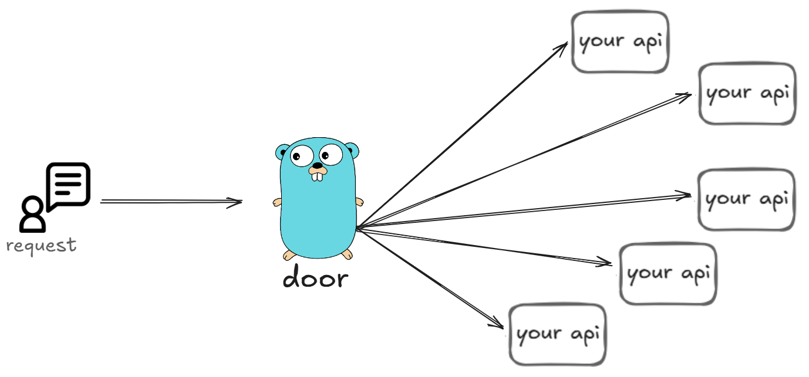

<div align="center">
  

  <h1>Door</h1>
  <p>A lightweight, high-performance API Gateway written in Go.</p>

  
  
  
  
</div>

---

**Door** sits between your clients and your backend services — handling authentication, routing, and logging so your APIs don't have to.

## Features

- **JWT Authentication** — access + refresh token strategy with bcrypt password hashing
- **Application Registry** — register and manage proxy target URLs through a REST API
- **Request Logging** — every request is captured asynchronously: method, path, IP, response time, status code, and more
- **CORS Middleware** — configurable per-origin with preflight support
- **Angular Dashboard** — built-in frontend for managing applications and auth flows
- **Auto Migrations** — database schema is applied automatically on startup (SQLite + golang-migrate)

## Tech Stack

| Layer | Technology |
|---|---|
| Runtime | Go + FastHTTP |
| Database | SQLite3 |
| Auth | JWT (HS256) + bcrypt |
| Frontend | Angular 21 |
| Migrations | golang-migrate |

## Getting Started

### Prerequisites

- Go 1.21+
- Node.js 18+ (frontend only)

### 1. Clone & configure

```bash
git clone https://github.com/hugaojanuario/door.git
cd door
cp .env.example .env
```

Edit `.env` with your secrets:

```env
JWT_ACCESS_TOKEN_SECRET=your_access_secret
JWT_REFRESH_TOKEN_SECRET=your_refresh_secret
ALLOWED_ORIGINS=http://localhost:4200
BASE_URL=http://localhost:7171
MAX_ATTEMPTS=50
TIMEOUT=5
```

### 2. Run the backend

```bash
cd cmd/api
go run main.go
```

Server starts on `http://localhost:7171`. Database migrations run automatically.

### 3. Run the frontend (optional)

```bash
cd frontend
npm install
npm start
```

Dashboard available at `http://localhost:4200`.

## API Reference

### Authentication

| Method | Endpoint | Description |
|---|---|---|
| `POST` | `/api/v1/auth/register` | Register a new user |
| `POST` | `/api/v1/auth/login` | Login and receive tokens |
| `GET` | `/api/v1/auth/token` | Validate / refresh access token |
| `POST` | `/api/v1/auth/logout` | Logout and clear session |

### Applications (proxy targets)

All routes below require `Authorization: Bearer <access_token>`.

| Method | Endpoint | Description |
|---|---|---|
| `GET` | `/api/v1/applications` | List all registered applications |
| `GET` | `/api/v1/applications/:id` | Get a single application |
| `POST` | `/api/v1/applications` | Register a new application |
| `DELETE` | `/api/v1/applications/:id` | Remove an application |

### Example: Register a user

```bash
curl -X POST http://localhost:7171/api/v1/auth/register \
  -H "Content-Type: application/json" \
  -d '{"username": "john", "email": "john@example.com", "password": "secret123"}'
```

### Example: Add an application

```bash
curl -X POST http://localhost:7171/api/v1/applications \
  -H "Authorization: Bearer <token>" \
  -H "Content-Type: application/json" \
  -d '{"url": "http://my-service:8080", "country": "BR"}'
```

## Project Structure

```
door/
├── cmd/api/            # Entry point
├── internal/
│   ├── domain/         # Entities and validation
│   ├── http/
│   │   ├── handler/    # Route handlers
│   │   ├── middlewares/# CORS, auth, request logger
│   │   └── dtos/       # Request / response models
│   ├── services/       # Business logic
│   └── repository/     # Database queries
├── pkg/                # Shared utilities (JWT, crypto, logger, db)
├── db/migrations/      # SQL migration files
├── frontend/           # Angular application
├── hacks/              # .http files for manual testing
└── tests/              # Integration tests (Python/pytest)
```

## Token Strategy

- **Access token** — short-lived (15 min), kept in memory on the client
- **Refresh token** — long-lived (24h), stored in localStorage
- Protected routes validate the `Authorization: Bearer` header via middleware

## Running Tests

```bash
# Python integration tests
cd tests/auth
pip install pytest requests
pytest login.py
```

You can also use the `.http` files in `hacks/` with any HTTP client (e.g. VS Code REST Client, IntelliJ).

## License

MIT
